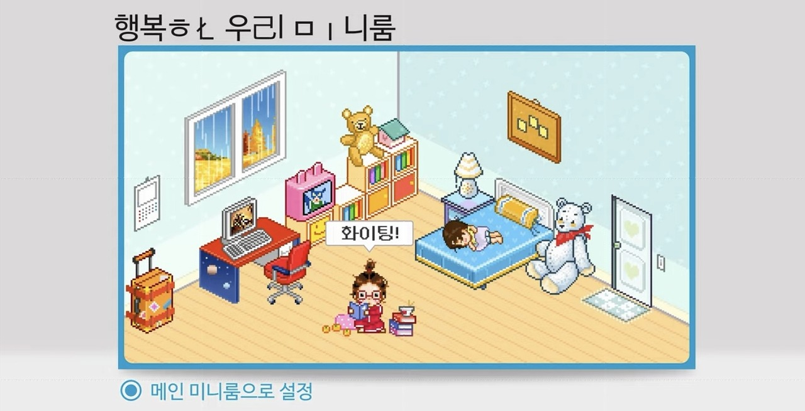

<!-- 제목 -->
<!-- <h1 align="center">Hi 👋, I'm Grokeen from Korea 🇰🇷</h1> -->
<!-- <h3 align="center">Surviving as a developer 🧗‍♀️</h3>   -->

<!-- 깃허브 상태 -->
<!--  -->

<!--
📌 [포트폴리오](/portfolio.md)
📌 [PDF 다운로드](https://drive.google.com/file/d/1kXj9weLHKVow_333rESxEHxEiERa0n4B/view?usp=sharing)
📌 [메일 보내기](mailto:ygreen0516@gmail.com)
-->

<!-- 백준 알고리즘 레벨 -->
<!--  -->

<!--  -->

        

            

                <!--  -->
                

                    

                        

                            
                        

                    

                

                <!-- 사이드바? -->
                

                    

                        <ul style="list-style: none;
    padding: 0;
    background-color: hsla(193, 36%, 52%, 0.891);
    border-radius: 10px / 40px;" >
                            <li style="margin: 10px;
    text-align: center;"><a style="text-decoration: none;
    color: #ffffff;
    font-weight: bold;" href="https://github.com/Grokeen">홈</a></li>
                        </ul>
                        <ul style="list-style: none;
    padding: 0;
    background-color: hsla(193, 36%, 52%, 0.891);
    border-radius: 10px / 40px;" >
                            <li style="margin: 10px;
    text-align: center;"><a style="text-decoration: none;
    color: #ffffff;
    font-weight: bold;" href="https://Grokeen.github.io">미니룸</a></li>
                        </ul>
                        <ul style="list-style: none;
    padding: 0;
    background-color: hsla(193, 36%, 52%, 0.891);
    border-radius: 10px / 40px;" >
                            <li style="margin: 10px;
    text-align: center;"><a style="text-decoration: none;
    color: #ffffff;
    font-weight: bold;" href="#">일촌평</a></li>
                        </ul>
                        <ul style="list-style: none;
    padding: 0;
    background-color: hsla(193, 36%, 52%, 0.891);
    border-radius: 10px / 40px;" >
                            <li style="margin: 10px;
    text-align: center;"><a style="text-decoration: none;
    color: #ffffff;
    font-weight: bold;" href="mailto:ygreen0516@gmail.com">편지함</a></li>
                        </ul>
                    

                

                <!--  -->
                

                    

                        
                    

                    

                        🖥️ Frontend : React 
                        🔌 Backend : Spring, Django
                    

                    

                        
                        
                        
                    

                

                <!--  -->
            

        

    

